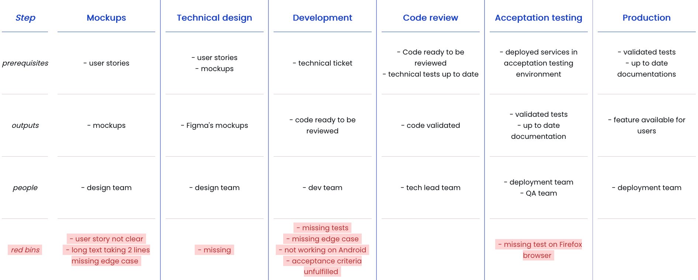

# Visual management improves team efficiency

## Plan

Intro

0. Projects are a set of flows
1. Rex
   1. dev -> pain points
   2. TML -> pain points (ça s'accumule)
2. Partage infos entre les membres de l'équipe
   1. Création d'un Kanban
   2. Consolider et simplifier
   3. Mise à jour
3. Prise de décision

   1. Voir les problèmes
      1. Les bacs rouges
      2. Les traiter

4. Conclusion

## Article

When I started my career as a developer, I always struggled to get a view of the big picture in my projects. I developed and, sometimes, reverted my work depending on what I was asked for. It was frustrating and counterproductive.

Hi my name is Julien, I'm a team leader at BAM. I'm now a manager and my goal is to make the team succeed. That's freaking hard!

In this article, we'll see together how visual management can drastically help a team to get a clearer vision, be more aware of improvements and be accountable for the main goals.

Let me clarify the problems we want to solve: how can we onboard people, share as much information as possible in the team and how the team decisions can be the best decisions to make?

This is a really ambitious goal but the good news is that every step going forward is a small improvement in team comprehension about the product and how the product is made. For that, we need two steps:

1. Show your flow
2. Show your problems

### First, start with the flow

Let's say you're developing a product. This product has a bunch of features. What "show your flow" means is to display everything a feature needs to be in the users' hands (if it's a product that can be held in a hand). Yes, we're clearly talking about Kanban. So how does the team do it?

1. Names the steps,
2. List the prerequisite to complete these steps,
3. list the output asked in these steps,
4. list who needs to complete these steps.

[Ajouter une image d'un exemple de flux]

This action not only lets you show the progress of every feature and how much they are close to being done but this helps clarify the process with your team too. You can be surprised by how much people's thinking diverges. "oh, I didn't know we had a pitch with the client before, I may be helpful to complete it", "oh, that's when we create the mockups! But that's a lot of lead time before we really need them".

#### Consolidate and simplify your visual management

Make sure the inputs and outputs are feasible and every step can be done **without going back in the process**. Then look after simplification [qu'est-ce que ça veut dire simplifier ?].

Now on a daily basis, the team updates the feature status and puts some rules on how to prioritize tasks. [donner un exemple de règle dans un board visuel]. These rules are your North star and helps your decision making. [Plus parler de l'importance du geste quotidien : un management visuel n'est utile que si il est à jour]

This is why this is called visual **management**. It helps you manage a project because it shows you the next thing to do according to your rules. This is very powerful: from a decision by one manager to a team that can decide by itself _(themself?)_ the best possible decision according to what information is displayed.

As it seems easy and straightforward, the team will fail, you'll fail many times on your decision making. Because you're lacking information. This is why we need the next step.

### Show your problems

Visual management will help you do better because it will highlight things the team has trouble with.

Add a line in your flow called: red bins. Every time you need to go back to complete a certain task, create a red bin with the problem and the reason why you needed to go back. _Going back is a waste_ that can be prevented in the future if the team investigates and solves the problem.

After a while, it will be clear where the team needs to put their effect on. Red bins will start to stack in particular steps (functional design, mockup, marketing, etc.). Find out what can be improved and check if red bins still occur for the same reason.

### Conclusion

Did you see where we came from to where we are? From a foggy view to a clear vision for all the team members. The more the team is autonomous and proactive on what action to do next, the more the manager's role changes. It is now in a role of supporting the team to improve and help solve problems.

Of course it will be hard and still not completely clear but knowing where the fog is already a first step. As a team you can improve and clarify. Thanks to visual management, you are guided, like a map, it shows you what you know and what you don't know. What matters is that you're on a continuous improvement path!

---

- Trouver une balance entre respect, écoute et hiérarchie
- J'étais bien dans ma zone de confort, mais le management que je voyais ne me convenait pas et j'en suis venu à être à la place de ces managers.

---

- Twitter : être authentique, parler du pourquoi de l'article et en quoi ça m'a aider.
  - My vision about being a manager is all about sharing information and leveraging others, a good visual management helped me so much I wanted to share with you a step by step article.
